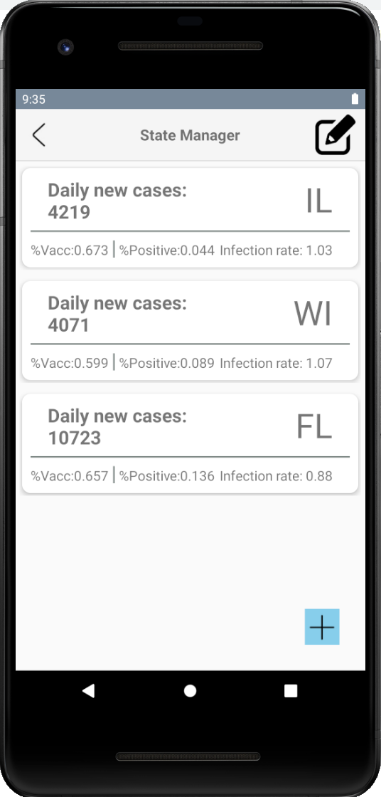
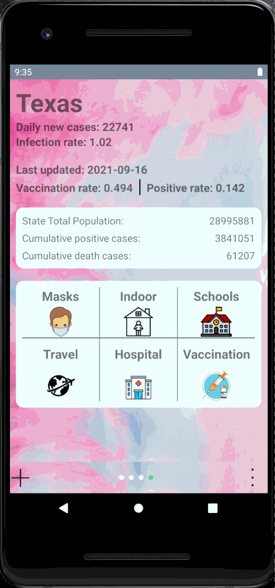
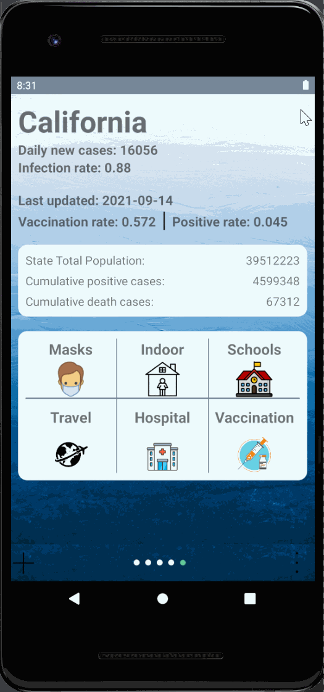

# Android Application Development: CovidNowApp
Contributor: Xiuyu Liu; Qingqing Cao
## Descriptions
Covid Now is an Android app providing real-time covid information of each state in the United States. We deveoped this app to display important covid information (infection, hospitalization, vaccine) of areas requested by users. [Covid Now API](https://covidactnow.org/data-api) is integrated in the application to obtain real-time covid data. SQLite database is used to locally store and manage covid data offline. We also developed CRUD operations on managing the covid-related information.

## Project demo

  

## Features
The app contains five pages -- main page, state manager page, search page, delete page and setting page.
| Main Page | State Manager | Add more states | Delete existing states | App Setting |
| :---         |     :---       |  :---  |     :---  |   :---  |
|    |  |     |    |    |
| git diff     | git diff       | git diff      | git status    | git status    |

On the main page, the user is able to acquire covid related information and recommendations for each state. The user is able to slide among saved states using fragments with ViewPager.

Click the plus icon on the left bottom corner of the main page, the user can enter the state manager page. On this page, the user is able to preview the saved states and enter the search page by clicking the right bottom icon and enter the delete page by clicking the edit icon on the right top corner.

On the search page, the user has two ways to add states in the database, either by click the hot states item or by searching state names directly. After adding the state, the page will jump to the main page and the newly added state is shown.

On the delete state page, the user is able to delete saved states. After deleting the state, the page will jump to the main page. If all states are deleted, Illinois will show as a default state on the main page.

The user is able to go to the setting page by clicking on the right bottom icon on the main page. In the setting page, the user is able to change background, check the current version, clean cache and share this app. Three backgrounds are provided in the app. Cleaning cache will delete all saved states and go to the default state -- Illinois -- on the main page. Sharing this will lead users to the default sharing app list in the mobile.

## Supported devices
The Android app is supported on devices with API level 17 and above, that is Android 4.2 and above.

The app uses the Covid Act Now API. Internet connection is required.

## Contribution
Covid Now app is a free and open source project developed by Xiuyu Liu (xiuyul2@illinois.edu) and Qingqing Cao (qc13@illinois.edu). Any contributions are welcome. Here are a few ways you can help:
* Report bugs and make suggestions.
* Write some code. Please follow the code style used in the project to make a review process faster.
 

## License
This application is released under MIT. Some of the used libraries are released under different licenses.
 
 

